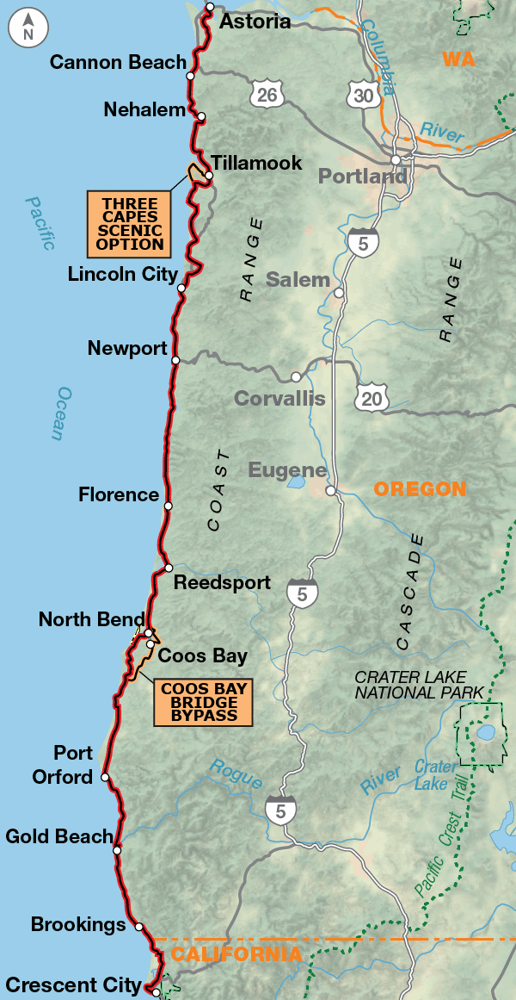

Life is filled with all manner of perplexing paradoxes. Sometimes you need to stop looking
for something to find it, speak to less people to make more friends, or move slower to
get more done. This was a lesson I relearned while biking down the Oregon Coast.

## The Route

The Oregon Coast is the second section of what is known as the
[Pacific Coast Highway](https://www.adventurecycling.org/routes-and-maps/adventure-cycling-route-network/pacific-coast/).
It's a 641km ride which primarily follows highway 101, tracing forests, cliffs, and beaches
all the way down to California (and beyond if one were so inclined).

## Some quick data

|Day|Destination|Distance (km)|Elevation (m)|Time on Bike (hrs)|
|-|-|-:|-:|-:|
|1|Nehalem Bay State Park|63.1|597|3.32|
|2|Pacific City|84.0|517|4.32|
|3|Beaverly Beach|77.0|671|4.00|
|4|Beach Side|44.0|326|1.97|
|5|Umquah Lighthouse|95.8|967|5.05|
|6|Bullard’s Beach|77.4|767|4.02|
|7|Mt Humbug|63.2|496|3.10|
|8|Harris Beach|80.4|1,109|4.25|
|9|Crescent City|46.7|245|2.42|
||Total|631.6|5,695.0|32.4|
||Average|70.2|632.8|3.6|

## A bit of narrative

Anyone who's done a somewhat larger trip like this knows that any such trip begins far before the first day
of the trip. There are plans to make, maps to consult, and plenty of training. I opted for a reasonably
relaxed rig and brought significantly more gear than I needed (such as a chair and a hamock). All together
my gear ended up being around 22kg if I remember correctly, on top of my ~15kg bike.



Then on Friday, 2023-07-28, my wife and I loaded up the car and rolled on down to Astoria from Seattle to drop me off.

### Trip to Manzanita

My first day I knew that I was staying at Nehalem Bay State Park. Once we got to Astoria, and I had breakfast, I
loaded up my bike, kissed my wife, and got rolling.



Not long down the road, I eventually made it to Cannon Beach where I would see my wife one last time before I would eventually make it down to California 8 days later.



### First Camp Site&mdash;Nehalem Bay State Park

For those who aren't aware, Oregon is something of a bike touring heaven. Just about every state (and county, as it would seem) park where there is camping has
what we call a "Hiker Biker Site". These are sites which are reserved for those hiking and biking in the area and don't have vehicles. Not only are these sites
tramendously cheap (\$7-\$10), they also will not turn you away. This meant that I didn't need to make a single reservation, and wasn't shackled by any kind of
itinerary.



I found the first camp site to be a beautiful place, and I had the good fortune to meet Aaron and Jannet. They were just finishing a TransAm tour on their
tandem bike (a beautiful comotion number which had me drooling).



### Kindness On The Road

This first night was a fantastic start to my tour, and was consistent with my overall experience on tour. I found consistently that the best part of any
given day wasn't so much the cycling, the views, or the feeling of being free and on the road (all spectacular on their own), but it was the steady stream
of kindness people had. Whether it was other bicycle tourists, hikers, or other random people in campsites or along the road _everyone_ around me was kind
and good natured. 

### Day 2&mdash;Pacific City



This was a blast of a day, I hadn't planned to ride this far, but I was having so much fun I didn't want to stop.

### The Tillamook Factory

Tillamook, Oregon is known for its cheese! Dairy of all kind, actually. And they have a very fun self-guided tour of their cheese making process. I'm not
sure if the line for ice cream would have been worth it (I didn't want to find out), but the tour and free cheese samples certainly were one of the highlights
of the day.



### Pacific City

On the second night I stayed at the Webb County Campground. It's part of the Tillamook County parks system I believe. That fact is significant because Tillamook
county charges _much_ more for their sites than Oregon State does. A hiker biker costs a whopping \$20. I'll also point out that unlike the Oregon State Parks, I
had to pay for showers here. From what I understand the \$20 is mainly a processing fee, the following night would be $9, and that carries through between sites;
so anyone doing this route should either try to stay in Tillamook County twice in a row, or simply skip it all together.

All that said, Pacific City is a total surf town, so everyone there was there to surf. It made for a very friendly atmosphere and somewhat reminded me of a climber's campsite.
Everyone is there to do the thing they love the most and are all part of the same community. They spoke the same language, camped at the same place, and rode the same waves.

Not to mention the fact that there were like 100 rabbits in the campgrount, all hopping around, happy as can be, and very comfortable with people.



### Day 3&mdash;Ride to Beaverly Beach

This was another day I hadn't planned on riding this far. I had figured that as I was slipping my schedule by a day, I would likely be landing at Lincoln City,
but once I was there I couldn't help but push forward.

The ride down was a fun mix of a lush forest valley, and beautiful beaches.





I also managed to see a gaggle of sea lions hanging out in the water.




If all that weren't reason enough, the sites at Beaverly Beach were worth the time to get to.



### Friends, Friends, Friends

### Day 4&mdash;Ride to Beachside
